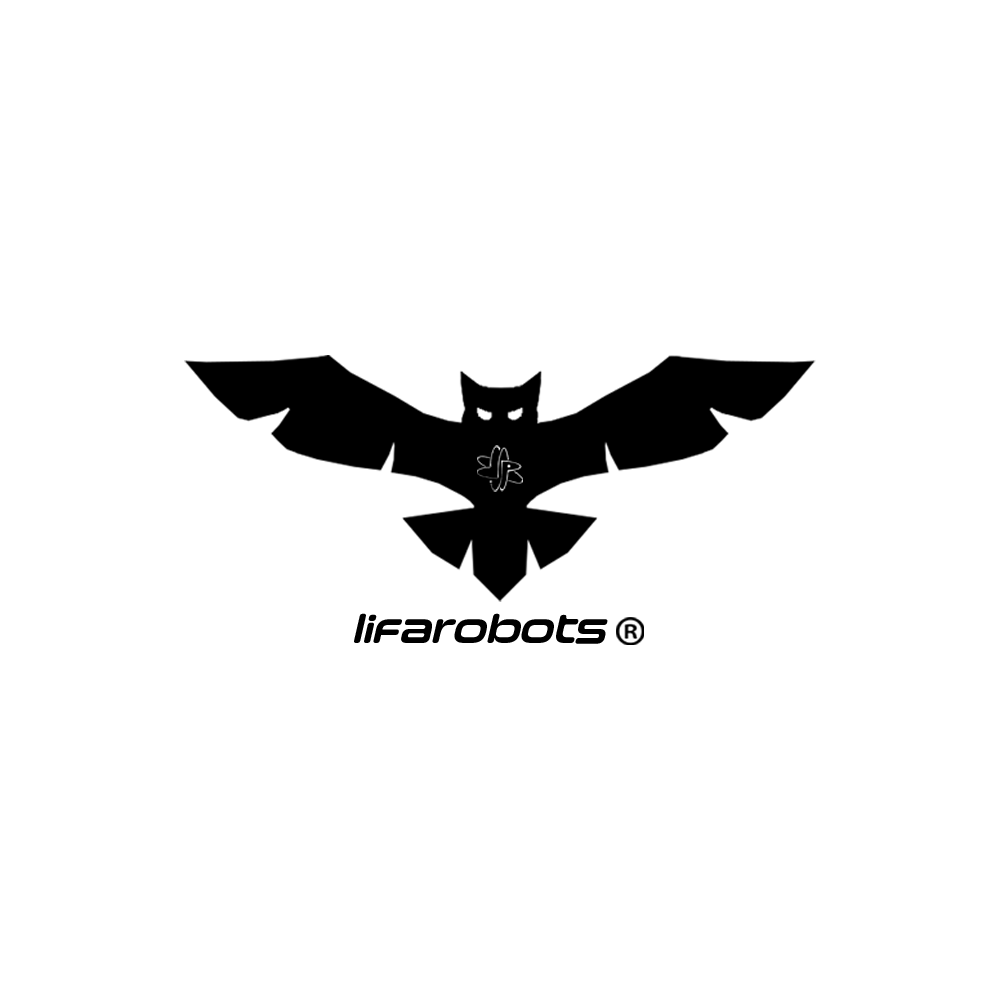

  

  <h1>Rodrigo Bon</h1>

  

    <strong>Programação embarcada | Embedded programming</strong>
  

  

    Engenharia Elétrica - Sistemas Eletrônicos | UFJF
  

  
  

   
   

  

---

## Sobre mim | About me

**PT-BR**  
Sou estudante de Engenharia Elétrica com habilitação em Sistemas Eletrônicos na Universidade Federal de Juiz de Fora. Tenho foco em programação embarcada, eletrônica, C/C++, algoritmos, estruturas de dados e desenvolvimento de baixo nível. Gosto de construir robôs de combate, automações e sistemas que conectam software, hardware e tomada de decisão no mundo real.

**EN**  
I am an Electrical Engineering student focused on Electronic Systems at the Federal University of Juiz de Fora. My main interests are embedded programming, electronics, C/C++, algorithms, data structures and low-level development. I enjoy building combat robots, automation projects and systems that connect software, hardware and real-world decision making.

> "Onde há determinação, o caminho pode ser encontrado."

## Estudando agora | Currently learning

  
  
  
  
  

**PT-BR**  
Atualmente estou aprofundando meus estudos em:

| Área | Foco |
| --- | --- |
| Eletrônica | circuitos, sistemas eletrônicos e integração entre hardware e software |
| C/C++ | programação para sistemas embarcados e desenvolvimento de firmware |
| Assembly | fundamentos de arquitetura, registradores, instruções e execução em baixo nível |
| Algoritmos e estruturas de dados | organização, análise e implementação de soluções eficientes |
| Programação de baixo nível | memória, periféricos, microcontroladores e controle direto de hardware |

**EN**  
I am currently deepening my studies in:

| Area | Focus |
| --- | --- |
| Electronics | circuits, electronic systems and hardware/software integration |
| C/C++ | embedded systems programming and firmware development |
| Assembly | architecture fundamentals, registers, instructions and low-level execution |
| Algorithms and data structures | organization, analysis and implementation of efficient solutions |
| Low-level programming | memory, peripherals, microcontrollers and direct hardware control |

## Tecnologias | Technologies

### Linguagens | Languages

  
  
  

### Embarcados e eletrônica | Embedded and electronics

  
  
  
  
  

### Ferramentas | Tools

  
  
  
  
  

## Projetos | Projects

| Projeto | Descrição | Stack |
| --- | --- | --- |
| [Projeto PART - LIFA ROBOTS](https://www.instagram.com/projeto_part/) | Projeto de aplicação de robótica e tecnologia da Universidade Federal de Juiz de Fora. Applied robotics and technology project at UFJF. | `C/C++` `ESP32` `Arduino` `PlatformIO` `VS Code` `Altium Designer` `GitHub` |
| [Laboratório de Inovação e Física Aplicada - UFJF](https://www.instagram.com/lifa.ufjf/) | Laboratório do grupo de estudos em física aplicada da Universidade Federal de Juiz de Fora. Applied physics study group laboratory at UFJF. | `Eletrônica` `Física aplicada` `Pesquisa` |

## Contato | Contact

  
  

